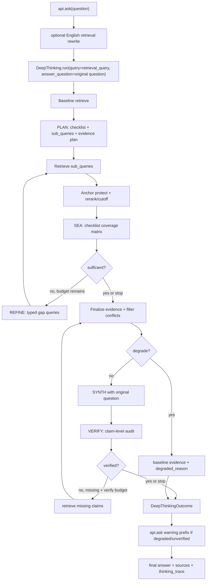

# Deep Thinking 数据流

```mermaid
flowchart TD
  A["api.ask(question)"] --> B["optional English retrieval rewrite"]
  B --> C["DeepThinking.run(query=retrieval_query, answer_question=original question)"]

  C --> D["Baseline retrieve"]
  D --> E["PLAN: checklist + sub_queries + evidence plan"]

  E --> F["Retrieve sub_queries"]
  F --> G["Anchor protect + rerank/cutoff"]
  G --> H["SEA: checklist coverage matrix"]

  H --> I{"sufficient?"}
  I -- "no, budget remains" --> J["REFINE: typed gap queries"]
  J --> F

  I -- "yes or stop" --> K["Finalize evidence + filter conflicts"]
  K --> L{"degrade?"}

  L -- "yes" --> M["baseline evidence + degraded_reason"]
  L -- "no" --> N["SYNTH with original question"]

  N --> O["VERIFY: claim-level audit"]
  O --> P{"verified?"}
  P -- "no, missing + verify budget" --> Q["retrieve missing claims"]
  Q --> K

  P -- "yes or stop" --> R["DeepThinkingOutcome"]
  M --> R
  R --> S["api.ask warning prefix if degraded/unverified"]
  S --> T["final answer + sources + thinking_trace"]
```
