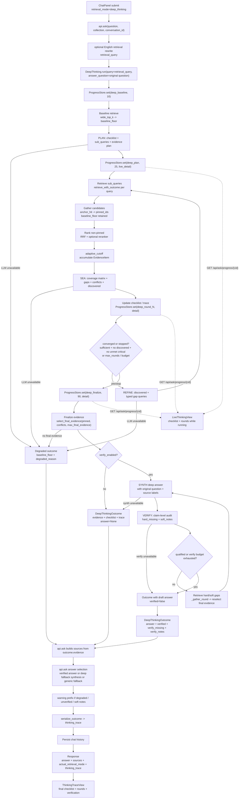

# Deep Thinking 数据流

```mermaid
flowchart TD
  A["ChatPanel submit<br/>retrieval_mode=deep_thinking"] --> B["api.ask(question, collection, conversation_id)"]
  B --> C["optional English retrieval rewrite<br/>retrieval_query"]
  C --> D["DeepThinking.run(query=retrieval_query,<br/>answer_question=original question)"]

  D --> E["ProgressStore.set(deep_baseline, 10)"]
  E --> F["Baseline retrieve<br/>wide_top_k -> baseline_floor"]
  F --> G["PLAN: checklist + sub_queries + evidence plan"]
  G -- "LLM unavailable" --> Z["Degraded outcome<br/>baseline_floor + degraded_reason"]
  G --> H["ProgressStore.set(deep_plan, 25, live_detail)"]

  H --> I["Retrieve sub_queries<br/>retrieve_with_outcome per query"]
  I --> J["Gather candidates<br/>anchor_hit -> pinned_ids<br/>baseline_floor retained"]
  J --> K["Rank non-pinned<br/>RRF + optional reranker"]
  K --> L["adaptive_cutoff<br/>accumulate EvidenceItem"]
  L --> M["SEA: coverage matrix + gaps + conflicts + discovered"]
  M -- "LLM unavailable" --> Z
  M --> N["Update checklist / trace<br/>ProgressStore.set(deep_round_N, detail)"]

  N --> O{"converged or stopped?<br/>sufficient + no discovered + no unmet critical<br/>or max_rounds / budget"}
  O -- "no" --> P["REFINE: discovered + typed gap queries"]
  P -- "LLM unavailable" --> Z
  P --> I

  O -- "yes/stop" --> Q["ProgressStore.set(deep_finalize, 90, detail)"]
  Q --> R["Finalize evidence<br/>select_final_evidence(pinned, conflicts, max_final_evidence)"]
  R -- "no final evidence" --> Z

  R --> S{"verify_enabled?"}
  S -- "no" --> T["DeepThinkingOutcome<br/>evidence + checklist + trace<br/>answer=None"]
  S -- "yes" --> U["SYNTH deep answer<br/>with original question + source labels"]
  U -- "synth unavailable" --> T
  U --> V["VERIFY: claim-level audit<br/>hard_missing + soft_notes"]
  V -- "verify unavailable" --> W["Outcome with draft answer<br/>verified=false"]
  V --> X{"qualified or verify budget exhausted?"}
  X -- "no" --> Y["Retrieve hard/soft gaps<br/>_gather_round -> reselect final evidence"]
  Y --> U
  X -- "yes" --> W
  W --> AA["DeepThinkingOutcome<br/>answer + verified + verify_missing + verify_notes"]

  Z --> AB["api.ask builds sources from outcome.evidence"]
  T --> AB
  AA --> AB
  AB --> AC["api.ask answer selection<br/>verified answer or deep fallback synthesis or generic fallback"]
  AC --> AD["warning prefix if degraded / unverified / soft notes"]
  AD --> AE["serialize_outcome -> thinking_trace"]
  AE --> AF["Persist chat history"]
  AF --> AG["Response<br/>answer + sources + actual_retrieval_mode + thinking_trace"]

  H -. "GET /api/ask/progress/{cid}" .-> AH["LiveThinkingView<br/>checklist + rounds while running"]
  N -. "GET /api/ask/progress/{cid}" .-> AH
  Q -. "GET /api/ask/progress/{cid}" .-> AH
  AG --> AI["ThinkingTraceView<br/>final checklist + rounds + verification"]
```
