# Research 数据流

> 对话式知识检索（probe → 报范围/模式 → 高置信直接执行 / 模糊则确认 → 召回）。
> 两个无状态工具由主 LLM 编排，全程只读，绝不修改 Zotero/Notion/R2 同步配置。
> deep_thinking 的内部推演见 [deep_thinking_flow.md](deep_thinking_flow.md)。

```mermaid
flowchart TD
  A["用户问到已收藏文献/研究内容"] --> B["主 LLM 编排<br/>(AstrBot @filter.llm_tool)"]

  %% ── 工具一：范围探查 ──
  B --> C["research_scope_probe(query)<br/>main.py · 只读"]
  C --> P["ResearchService.probe"]
  P --> P1["list_collections (排除 _ 系统集合)<br/>+ list_titles_by_collection"]
  P1 --> P2["集合打分: token 覆盖率<br/>name + description + titles"]
  P2 --> P3["命中论文 (标题 token) + 标签<br/>Zotero enrich author/year"]
  P3 --> P4["LightRAG 就绪度<br/>-> available_modes"]
  P4 --> P5["_exact_terms(query) -> ASCII 术语<br/>api.search_exact_mentions(全局)<br/>exact_match + exact_hits_top5"]
  P5 --> P6["assess ambiguity + suggest_mode"]
  P6 --> R1["probe 结果回喂 LLM<br/>candidates + ambiguity + modes<br/>+ exact_match + exact_hits_top5"]

  %% ── 主 LLM 决策 ──
  R1 --> D{"范围明确?<br/>ambiguity=low / exact_match<br/>或用户已确认"}
  D -- "模糊/竞争集合" --> DA["反问用户确认范围"] --> B
  D -- "明确" --> E["research_execute(query, collection,<br/>mode, breadth)<br/>main.py · 只读"]

  %% ── 工具二：执行召回（chat 侧编排） ──
  E --> F{"strict mode 且无 collection?<br/>deep_thinking / high_precision / graph_only"}
  F -- "是" --> FA["probe 自动绑定<br/>(ambiguity=low -> top collection)"]
  FA --> FB{"绑定成功?"}
  FB -- "否" --> FC["发送提示 + 返回 needs_scope<br/>(不静默改 default)"]
  FB -- "是" --> G
  F -- "否" --> G["发送「已开始检索」可见提示"]

  G --> H{"mode == deep_thinking?"}
  H -- "是" --> HA["asyncio.create_task 后台执行<br/>工具立即返回 started"]
  HA --> HB["_run_research_execute_background<br/>svc.execute(...) 完成后主动回发"]
  H -- "否" --> I["ResearchService.execute"]
  HB --> I

  %% ── ResearchService.execute ──
  I --> I1{"strict mode 且无 collection?"}
  I1 -- "是" --> IZ["needs_scope<br/>(不退化 default)"]
  I1 -- "否" --> I2["reranker 可用 & breadth=wide<br/>-> candidate_k = top_k * mult"]
  I2 --> J["api.ask(question, collection, mode,<br/>use_english_retrieval, candidate_k, use_reranker)"]

  %% ── api.ask 检索内核 ──
  J --> K["build scope: collection -> coll_key 子树<br/>(含全部后代)"]
  K --> L{"retrieval_mode"}
  L -- "graph_only" --> LG["LightRAG 图谱上下文<br/>(子作用域禁图谱)"]
  L -- "deep_thinking" --> LD["DeepThinkingOrchestrator.run<br/>collection 可为空=全局深挖<br/>见 deep_thinking_flow.md"]
  L -- "default / high_precision" --> M["_resolve_ask_collections<br/>全局=所有 active 集合 (无 [:5] 截断)<br/>集合 scope=父+后代名"]

  M --> N["逐集合 retrieve_with_outcome<br/>milvus dense + sqlite anchor/lexical"]
  N --> N1["候选文档集统一解析<br/>scope.allowed_doc_ids -> 子树/全局<br/>collection 为空 -> 全部 active 文档"]
  N1 --> N2["跨集合聚合候选<br/>无 early-stop break"]
  N2 --> N3["按 RRF 分全局排序 -> 截一次 top_k<br/>(单集合保留 orchestrator 次序)"]

  LG --> O["合成答案 + sources"]
  LD --> O
  N3 --> O

  %% ── 审计与回应 ──
  O --> Q["execute 审计封装<br/>searched_scope + exact_hit_count<br/>(api.search_exact_mentions 按范围)"]
  Q --> Q1["确定性引用列表<br/>Author - Year - Title (按文档去重)"]
  Q1 --> Q2{"答案为空?"}
  Q2 -- "是" --> Q3["「本次检索未命中(范围: X)」<br/>禁止说「库里没有」"]
  Q2 -- "否" --> Q4["answer + citations"]
  Q3 --> S
  Q4 --> S["返回 LLM / 用户<br/>answer + citations + searched_scope<br/>+ exact_hit_count + sources"]
  IZ --> S
  FC --> S

  %% ── 侧通道 ──
  HB -. "完成后主动推送" .-> S
  LD -. "GET /api/ask/progress/{cid}" .-> SV["LiveThinkingView / ThinkingTraceView"]
```

## 关键设计点

- **两工具、主 LLM 主导**：`research_scope_probe` 只做廉价元数据 + 正文精确命中探查；`research_execute` 才真正召回。范围/模式由主 LLM 判断，支持反问确认。
- **正文精确命中（防假阴性）**：probe/execute 都会对查询里的 ASCII 术语调 `search_exact_mentions` 扫正文 chunk——即使标题/标签没标注，也能发现命中，杜绝「metadata 空 → 误判库里没有」。
- **全局召回不漏**：`default` 全局覆盖所有 active 集合（移除前 5 个截断），跨集合聚合候选后按 RRF 全局排序一次截断（移除「凑满 top_k 就停」的提前退出）。
- **作用域含后代**：选中集合 = 该集合及其全部子集合；SQLite 词法/锚点通道按 `allowed_doc_ids` 覆盖子树，`collection` 为空时走全局 active 文档。
- **严格模式与降级边界**：`high_precision` / `graph_only` 必须有明确 collection；`deep_thinking` 在 WebUI（`api.ask`）允许全局，聊天端则先 probe 自动绑定或返回 `needs_scope`，绝不静默退化为 `default`。
- **诚实文案**：区分「本次检索未命中（范围：X）」与「库里没有」，并回带 `searched_scope` / `exact_hit_count` 审计字段。
